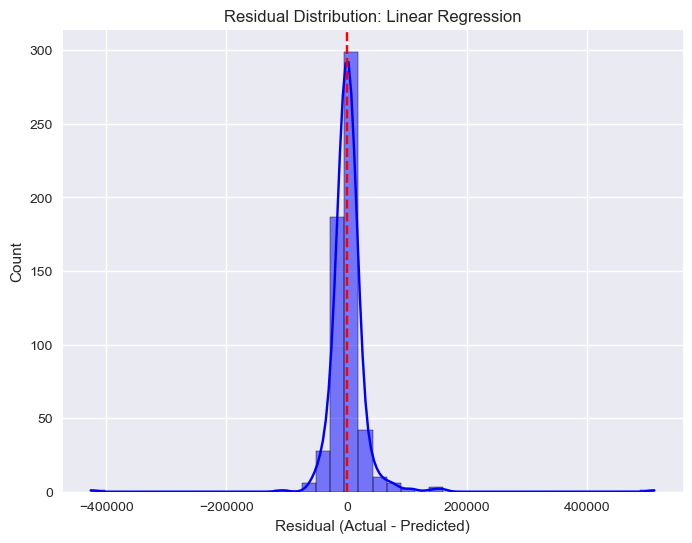
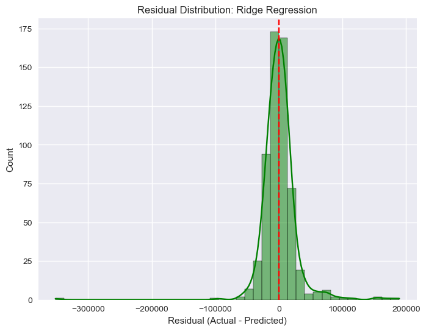
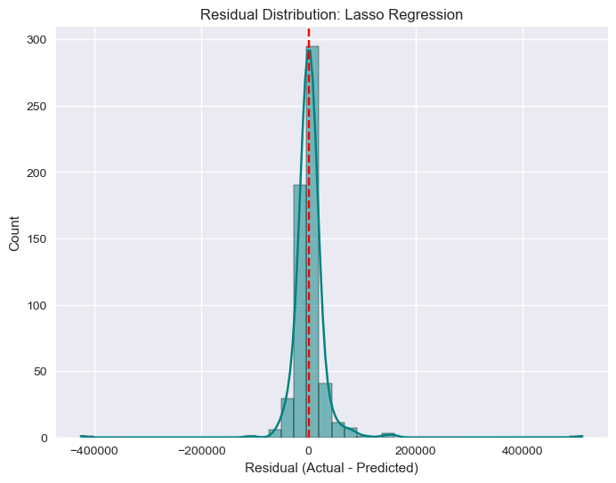
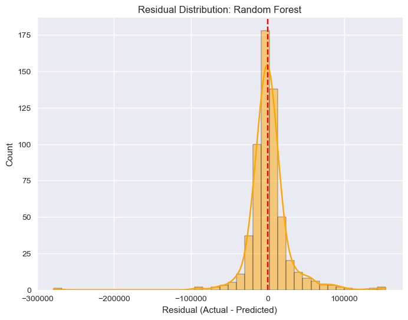
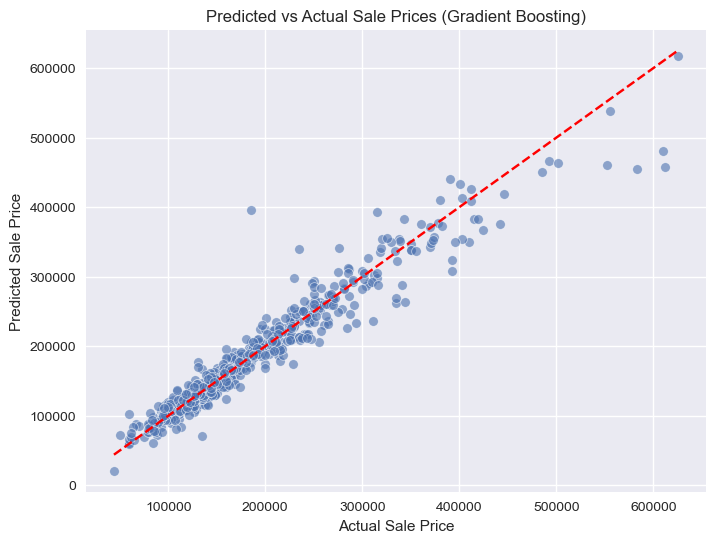
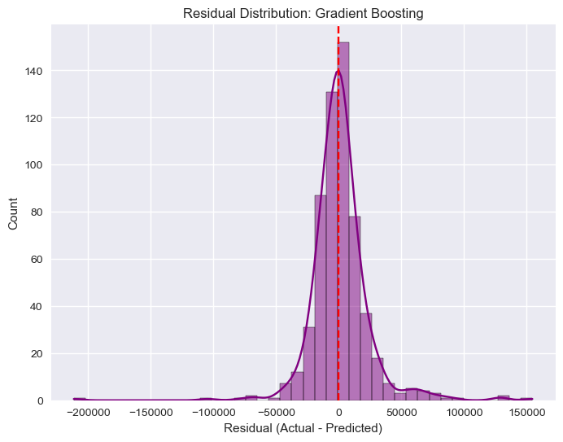
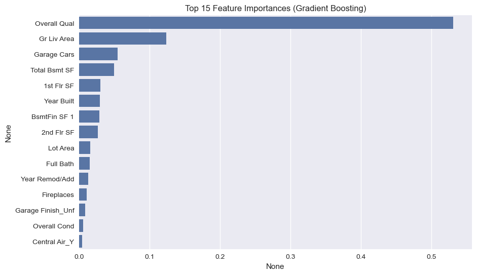

## Predicting Housing Prices with Machine Learning

**Arun Sai Pendyala**

### Executive Summary

**Project overview and goals:**  
The goal of this project is to develop a predictive model for estimating housing prices using the Ames Housing dataset. By analyzing property features such as size, quality, age, and location, the project aims to build accurate machine learning models that can support buyers, sellers, and policymakers in making data-driven decisions.

We compared multiple regression models **Linear Regression, Ridge, Lasso, Random Forest, and Gradient Boosting** to determine which best predicts home sale prices. After evaluation, the Gradient Boosting model emerged as the top performer.

**Findings:**  
The Gradient Boosting model achieved the strongest performance with an **R² of 0.931**, an **RMSE of ~$23,600**, and an **MAE of ~$14,300**. This means it explains over 93% of the variance in sale prices and predicts most homes within a few tens of thousands of dollars of their actual selling price.

Key insights include:

- **Overall Quality** and **Gr Liv Area (above-ground square footage)** are the most important drivers of housing price.
- **Garage Cars, Total Basement SF, and Year Built** also significantly influence price.
- Predictions are generally strong across the distribution, though high-value homes (>$400,000) tend to be slightly underestimated.

---

### Results and Conclusion

- **Best Model:** Gradient Boosting (R² = 0.931, RMSE = 23,600, MAE = 14,300).
- **Feature Importance:** The most influential features are Overall Quality, Living Area, and Garage Size.
- **Residuals Analysis:** Errors are centered around zero and roughly normal, suggesting predictions are unbiased. Outliers exist, particularly in very high-priced homes.

These results demonstrate that machine learning can provide valuable support for housing market analysis, offering transparency and interpretability into what drives property values.

---

### Future Research and Development

Potential next steps include:

- **Adding external factors** such as interest rates, school quality, or neighborhood-level demographics.
- **Testing more advanced models** such as XGBoost, LightGBM, or CatBoost for further performance gains.
- **Segmented modeling**, where separate models are trained for entry-level vs. luxury homes.
- **Temporal and spatial modeling** to incorporate year-of-sale and geographic effects.

---

### Rationale

Housing affordability is one of the most pressing economic issues today. Accurate house price prediction models can help buyers, sellers, and policymakers make informed decisions, support fair pricing, and anticipate affordability challenges.

---

### Research Question

The research question guiding this project:  
**What is the best regression model for predicting housing prices, and which property features have the greatest influence on sale price?**

---

### Data Sources

**Dataset:** Ames Housing dataset, originally compiled by Dean De Cock and available via [Kaggle](https://www.kaggle.com/datasets/prevek18/ames-housing-dataset).

- **Size:** 2,930 rows × 80 features.
- **Target variable:** SalePrice (continuous, USD).
- **Exploratory Data Analysis:** The dataset includes numeric and categorical features covering lot size, number of rooms, year built, garage size, neighborhood, and more. Missing values were imputed or filled with “None” where appropriate.
- **Final Dataset:** Cleaned and preprocessed with no missing values remaining.

---

### Methodology

Holdout cross validation was implemented: Models were trained on the training set (80%) and validated with the test set (20%).  
We evaluated models using **RMSE (Root Mean Squared Error), MAE (Mean Absolute Error), and R² (coefficient of determination)**.

These metrics are suitable for regression tasks:

- **RMSE** penalizes large errors more heavily and gives a sense of typical error size.
- **MAE** provides an average magnitude of errors, easy to interpret in dollar terms.
- **R²** explains the proportion of variance in sale prices captured by the model.

Formally, RMSE is defined as:

$$
RMSE = \sqrt{\frac{1}{n} \sum_{i=1}^n (y_i - \hat{y}_i)^2 }
$$

where \( y_i \) are actual values and \( \hat{y}\_i \) are predicted values.

Five models were trained, fine-tuned, and compared to identify the best-performing approach for this housing price prediction task.

---

**Linear Regression Model:**  
A baseline model was trained using ordinary least squares regression. This model assumes a linear relationship between predictors (house features) and the target (SalePrice). While simple and interpretable, linear regression can underperform when nonlinear interactions exist in the data.

---

**Ridge Regression Model:**  
Ridge regression extends linear regression by adding an L2 penalty term, which reduces the impact of less important features and mitigates multicollinearity. Hyperparameter tuning was performed for the penalty strength (alpha values ranging from 0.01 to 100). Ridge achieved higher accuracy than simple linear regression, demonstrating the value of regularization.

---

**Lasso Regression Model:**  
Lasso regression adds an L1 penalty, which can shrink some coefficients to zero, effectively performing feature selection. This model is particularly useful for high-dimensional data. Hyperparameters for alpha were tuned similarly to Ridge. While Lasso was interpretable, it did not outperform Ridge or tree-based models on this dataset.

---

**Random Forest Model:**  
Random Forest regression constructs an ensemble of decision trees and averages their predictions to reduce overfitting. Hyperparameters tuned included the number of trees (`n_estimators`), maximum depth of trees, and minimum samples per split. Random Forest captured nonlinear relationships better than linear models and improved predictive accuracy, though at the cost of reduced interpretability.

---

**Gradient Boosting Model:**  
Gradient Boosting builds trees sequentially, with each new tree correcting the errors of the previous ones. Hyperparameters tuned included number of trees (`n_estimators`), learning rate, and maximum tree depth. This model achieved the best performance overall, with an R² of 0.931, RMSE of 23,600, and MAE of 14,300. Its ability to capture complex interactions and minimize bias-variance tradeoffs makes it particularly effective for structured tabular data like housing.

---

**Summary**

By testing a progression of models — from simple (Linear, Ridge, Lasso) to more advanced ensemble methods (Random Forest, Gradient Boosting) — we demonstrated that boosting-based methods provide the best balance of accuracy and interpretability for predicting house prices in the Ames dataset.

---

### Model Evaluation and Results

Model performance was evaluated using RMSE, MAE, and R².  
In addition, residual plots and feature importance visualizations were used to better understand each model’s behavior.

---

**Linear Regression Model:**  
The Linear Regression model achieved an R² of **0.837**, with an RMSE of **36,097** and MAE of **16,655**.  
It provides a simple baseline but struggles with capturing nonlinear relationships. Predictions are less accurate for higher-priced homes, often underestimating their true values.

---

**Ridge Regression Model:**  
Ridge Regression improved performance compared to Linear Regression, with an R² of **0.893**, RMSE of **29,302**, and MAE of **16,662**.  
By applying L2 regularization, Ridge reduced overfitting and produced more stable predictions, though still weaker than tree-based models.

---

**Lasso Regression Model:**  
The Lasso Regression model performed similarly to Linear Regression, with an R² of **0.838**, RMSE of **36,018**, and MAE of **16,634**.  
Although useful for feature selection, Lasso did not provide significant performance gains for this dataset.

---

**Random Forest Model:**  
The Random Forest model substantially improved performance, achieving an R² of **0.910**, RMSE of **26,898**, and MAE of **15,715**.  
By averaging predictions across many trees, it captured nonlinear effects well. However, it still exhibited some overfitting and less interpretability compared to linear models.

---

**Gradient Boosting Model (Best Model):**  
The Gradient Boosting model achieved the best results overall, with an R² of **0.931**, RMSE of **23,600**, and MAE of **14,330**.  
It consistently outperformed the other models, with residuals tightly centered around zero and the most accurate predictions across all price ranges.

  
  

---

A detailed interpretation and evaluation of the Gradient Boosting model can be found in the **CapstoneEvaluation** notebook, where local feature importance (SHAP) and individual predictions are explored.

---

### Outline of Project

- [Link to Dataset](https://www.kaggle.com/datasets/prevek18/ames-housing-dataset)
- [Link to Exploratory Analysis](./notebooks/exploratory_analysis.ipynb)
- [Link to Advanced Models](./notebooks/advanced_models.ipynb)
- [Link to Evaluation Notebook](./notebooks/evaluation.ipynb)

---

### Contact and Further Information

Arun Sai Pendyala  
Email: arunpendyala01@gmail.com
